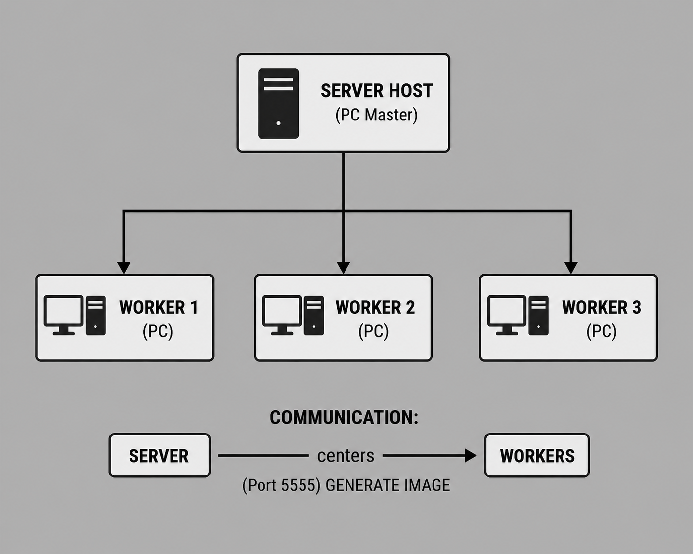
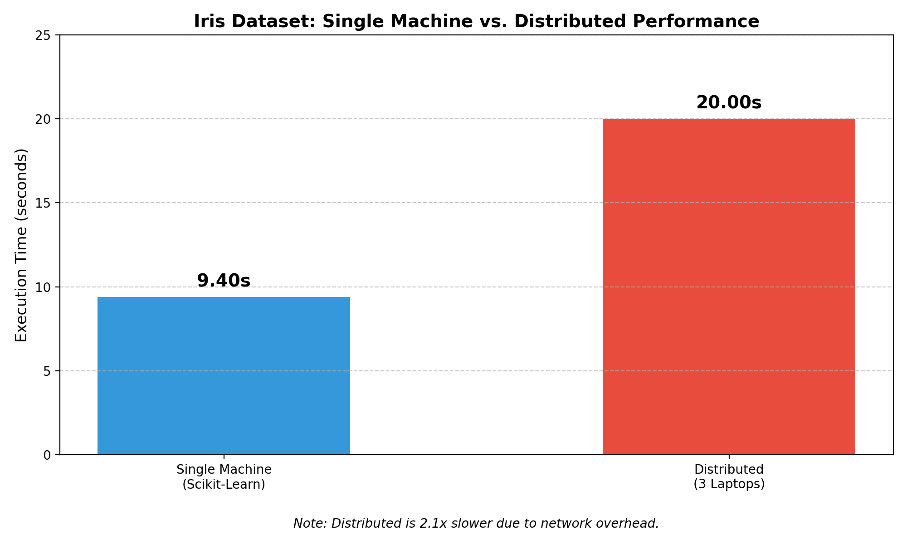
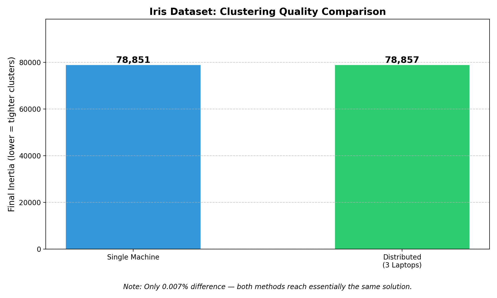
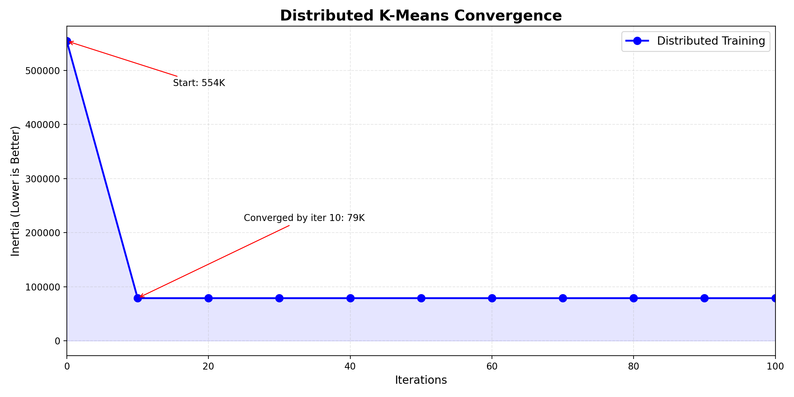
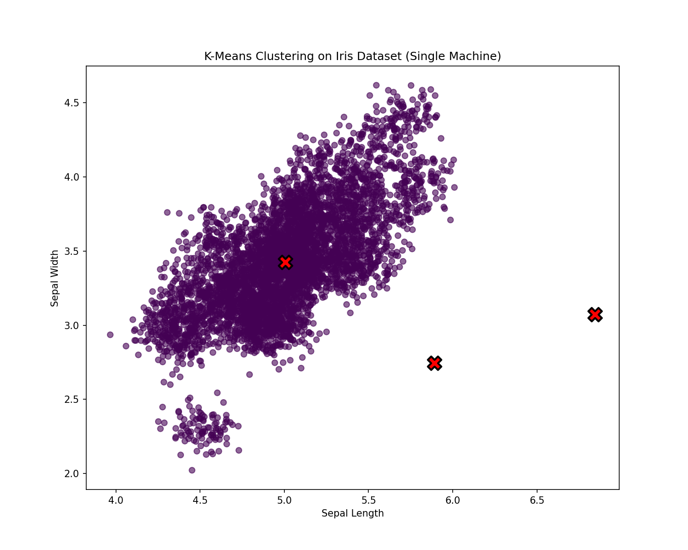
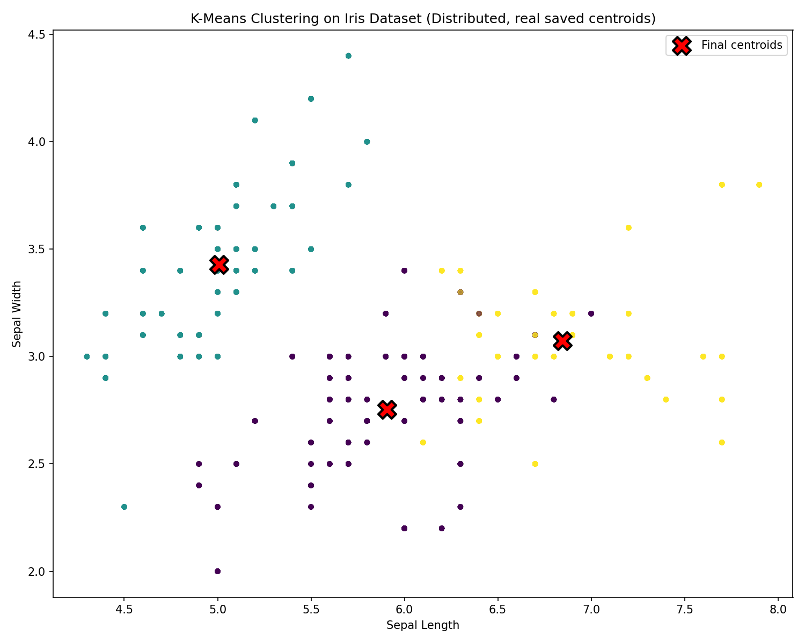

# Distributed K-Means via Parameter Server

A from-scratch implementation of distributed K-Means clustering using a parameter-server architecture, built and tested across a real 3-machine network (1 server + 2 workers) communicating over ZeroMQ. Built as a group assignment on distributed machine learning.

The project measures the real trade-off between distributing a workload and the network overhead of doing so, and includes a genuine debugging story: an initialization bug that quietly cost 8.6x in clustering quality, found by re-running the actual aggregation logic end-to-end. See [Results](#results).



## How it works

1. The **parameter server** holds the current cluster centroids and broadcasts them to all workers (ZeroMQ `PUB`).
2. Each **worker** loads its own partition of the dataset (hash-based split), assigns its local points to the nearest centroid, and computes local centroid updates.
3. Workers push their updates back to the server (ZeroMQ `PUSH`/`PULL`).
4. The server combines updates from all workers, weighted by how many points each worker processed, and updates the global centroids.
5. Repeat until convergence or the process is stopped, at which point the server saves the final centroids to disk.

This mirrors how real parameter-server systems (e.g. for large-scale neural network training) synchronize state across machines — K-Means was used here as a simple, interpretable algorithm to build and debug the distributed infrastructure itself.

## Results

Measured on the Iris dataset (4 features), augmented to 150,000 samples, k = 3 clusters:

| Metric | Single Machine | Distributed (3 laptops) |
|---|---|---|
| Wall-clock time | 9.4s | 20.0s |
| Final inertia | 78,851.44 | 78,856.89 (0.007% difference) |



The distributed version is ~2x slower here — at this dataset size, network round-trips between server and workers cost more than the compute they save, a direct measured illustration of Amdahl's Law. Despite the slowdown, the parameter server converges to essentially the same clustering quality as the single-machine baseline.



That result didn't come for free — our first version initialized centroids with arbitrary small random values and converged to a solution **8.6x worse** than the baseline. Fixing the initialization (seeding centroids from real data points) and using a larger per-worker batch size closed that gap almost entirely. Full write-up: [`results/RESULTS.md`](results/RESULTS.md)







## Project structure

```
.
├── src/
│   ├── server.py                 # Parameter server (run on the "server" machine)
│   ├── worker.py                 # Worker node (run on each "worker" machine)
│   ├── kmeans_parameters.py      # Centroid state: init, assignment, update, serialization
│   ├── single_machine_kmeans.py  # scikit-learn baseline for comparison
│   └── augment_dataset.py        # Scales the base Iris dataset up to 150K rows
├── scripts/
│   ├── plot_distributed_results.py  # Visualize saved centroids against the dataset
│   └── test_local.py                # Sanity-check dependencies/data before a multi-machine run
├── results/
│   ├── RESULTS.md                          # Full write-up of measured results
│   ├── comparison.txt                      # Raw single-machine baseline output
│   ├── convergence_log.csv                 # Real logged convergence trace
│   ├── final_cluster_centers.npy           # Centroids saved by the real distributed run
│   ├── performance_comparison.png
│   ├── quality_comparison.png
│   ├── convergence_plot.png
│   ├── single_machine_clusters.png
│   └── distributed_clusters.png
├── docs/
│   ├── architecture.png
│   └── Distributed_ML_Presentation.pdf/.pptx
├── IRIS.csv
├── requirements.txt
└── README.md
```

## Running it

### 1. Install dependencies
```bash
pip install -r requirements.txt
```

### 2. Prepare the dataset
```bash
python src/augment_dataset.py
```
This reads `IRIS.csv` and produces `iris_augmented.csv` (150,000 rows), which the rest of the scripts expect in the working directory.

### 3a. Run the single-machine baseline
```bash
python src/single_machine_kmeans.py
```

### 3b. Run the distributed version
On the machine that will act as the server:
```bash
python src/server.py
```
On each worker machine, first update `SERVER_IP` in `src/worker.py` to the server's IP address, then:
```bash
python src/worker.py
```
The server prints progress every 10 iterations and saves `final_cluster_centers.npy` on shutdown (`Ctrl+C`).

### 4. Visualize the result
```bash
python scripts/plot_distributed_results.py
```

## Tech stack

- **Python 3**, **NumPy** / **pandas** for data handling
- **ZeroMQ** (`pyzmq`) for server↔worker messaging (PUB/SUB for broadcast, PUSH/PULL for updates)
- **scikit-learn** for the single-machine baseline and dataset preprocessing
- **matplotlib** for result visualization

## Challenges & solutions

- **Communication overhead** — network latency outweighed the compute cost of K-Means at this scale. Solved by moving from a blocking REQ/REP pattern to async PUB/SUB + PUSH/PULL.
- **Node synchronization** — a slow or dropped worker could stall the server indefinitely. Solved with a 5-second poll timeout; the server proceeds with whichever workers responded.
- **Silent quality loss from bad initialization** — the distributed run converged fast but to a much worse solution than the baseline, because centroids started far from the real data distribution. Solved by seeding centroids from real data points instead of small random values (see [Results](#results)).

## What I'd do differently / future work

- Add fault tolerance for a worker dropping mid-run beyond the current timeout-and-continue logic
- Benchmark against a heavier per-point workload (e.g. mini-batch gradient updates for a small neural net) where distributing should actually pay off in wall-clock time, not just quality
- Automatically log full per-iteration convergence traces during the live networked run (this repo's convergence data was captured by re-running the aggregation logic directly; wiring that logging into `server.py` itself would let it come straight from the live run)
- Scale beyond 3 nodes to see how coordination overhead grows

## Team

Group M — distributed machine learning coursework project.
